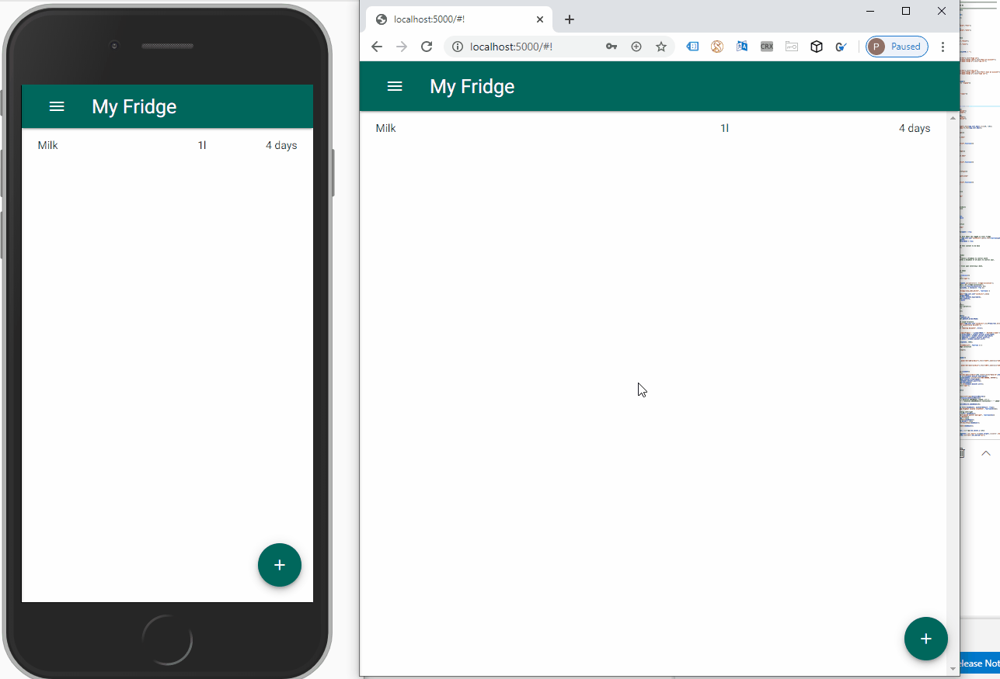
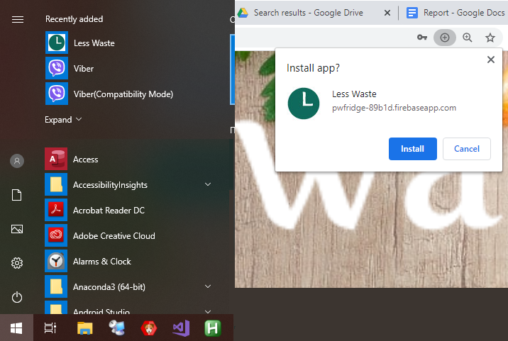
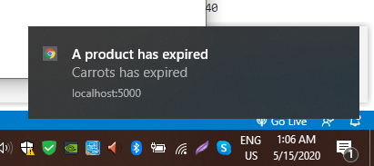
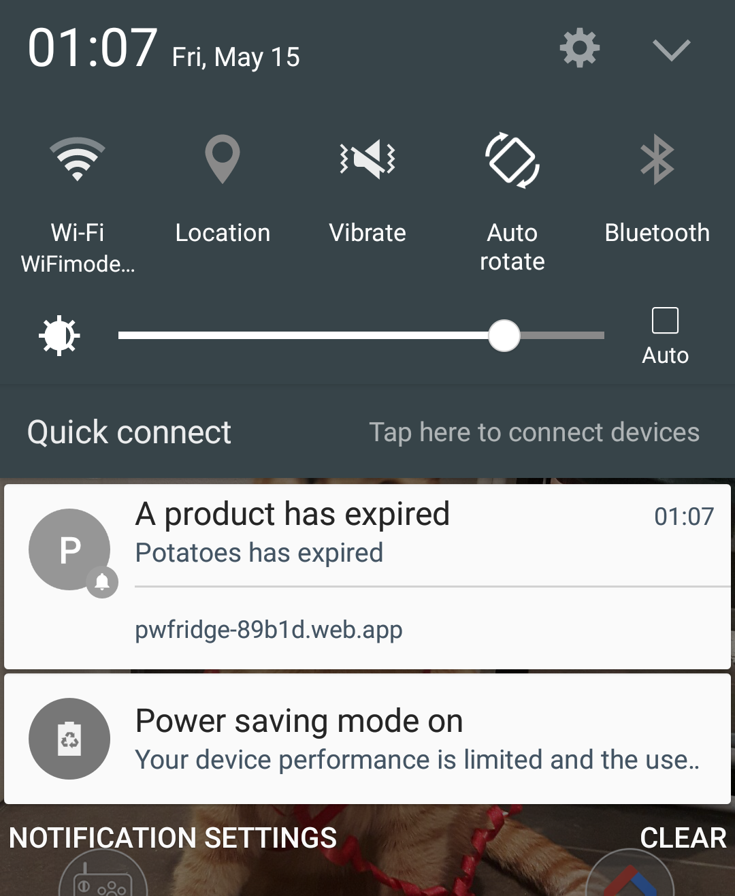

# Welcome

Github Pages: https://zwarmob.github.io/LessWaste-PWFridge/
Application site: https://pwfridge-89b1d.web.app/

Use the "demo login" to quickly access and test the application

Example of the app. Adding an item in one open instance would be shown on all instances.
Try it! Open the same account from multiple devices and you will see changes be syncronised across devices

This project was created for the final bachelor exam @ KEA. [report in Google Docs](https://docs.google.com/document/d/1MjotXsuZB-YKlW65CZoylPl493uB-JoRWTrfuaRz9Fc/edit?usp=sharing )

# Technologies summary

 - **PWA**
 - **Offline** capabilities (through **service workers** generated with `Workbox`)
 - _**Instant**_ (fast) **load** (application shell architecture and cached files thx to the manifest)
 - **Push notifications** 
 - **Cross platform** - desktop and mobile
 - **Responsive web design** - to accomodate it being cross platform (using `Materialize.css`, material design library)
 - **Interactive design** - `jQuery`, `Animate.css`, `SweetAlert2`, `Hammer.js` (for touch/drag interactions)
 - **Single code base**
 - **Serverless solution** - Using `Firebase` (from `Google`)
 - **Authentication and authorization**
 - **Real-time database** - displaying changes to the user without the need to refresh

# Features

## Progressive Web App (PWA)

### Both web and standalone:
Can be considered both a site and a standalone application. Both mobile and desktop with a single codebase!

Installation prompt on desktop and application added to recently installed programs list:

Installation on mobile:

### Notifications:

Ability to notify users both desktop and mobile of expiring products**:

desktop notification:

mobile notification:

**Just a PoC. To test, you need two devices. Log in on both. Allow notifications on one and close the app. Now you can add a product that is near expiry or expired on the second device, and you should see a push notification on the first.

### Offline capabilities:
Application could work offline thanks to service workers that cache files. Firestore from firebase can be used while offline too. Data is synchronised accross devices when the device comes back online
